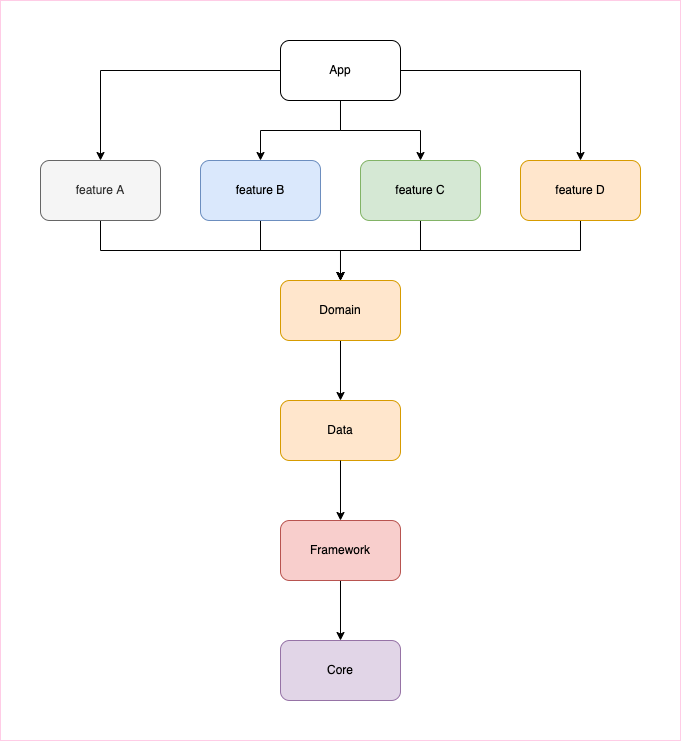

# Android Modularization

## Table of Contents

- [Overview](#overview)

- [Preparation](#preparation)

- [Modularization strategy](#modularization-strategy)
  
  - [Layer based solution](#layer-based-solution)
  
  - [Feature based solution](#feature-based-solution)
  
  - [Hybrid solution](#hybrid-solution)
  
  - [Summary and comparison](#summary-and-comparison)

- [Module management](#module-management)
  
  - [Resources management](#resources-management)
  
  - [AndroidManifest.xml](#androidmanifestxml)
  
  - [proguard-rules.pro](#proguard-rulespro)
  
  - [Code base - Multiple times definition](#code-base---multiple-times-definition)
  
  - [Code base - No such method error](#code-base---no-such-method-error)
  
  - [Recommendation](#recommendation)

- [Communication between features](#communication-between-features)
  
  - [Dependency injection](#dependency-injection)
    
    - [Implementation injection](#implementation-injection)
    
    - [Interface injection](#interface-injection)
    
    - [Provider injection](#provider-injection)
  
  - [Cyclic dependency](#cyclic-dependency)

- [Compile time strong dependency vs Runtime weak dependency](#compile-time-strong-dependency-vs-runtime-weak-dependency)
  
  - [Convert to runtime weak dependency](#convert-to-runtime-weak-dependency)
    
    - [Create backbone](#create-backbone)
    
    - [Create feature service provider](#create-feature-service-provider)
    
    - [Access service provider](#access-service-provider)

- [Examples](#examples)
  
  - [Basic usage](./#basic-usage)
  
  - [Intermediate usage](./#intermediate-usage)
  
  - [Advanced usage](./#advanced-usage)

- [References](#reference)

### Overview

In an ever-growing codebase, scalability, readability, and overall code quality often decrease through time. This comes as a result of the codebase increasing in size without its maintainers taking active measures to enforce a structure that is easily maintainable.

Modularization is a means of structuring your codebase in a way that improves maintainability and helps avoid these problems.

In here, we will focus on

- Modularization strategy

- Module management

- Communication between modules

- Compile time strong reference vs Runtime weak reference

- Examples

### Preparation

During the solution design, we will use dependency injection. In android, we usually use Dagger / Hilt.

- [Dagger 2](https://dagger.dev/dev-guide/)

- [Hilt](https://dagger.dev/hilt/)

- [Dependency injection with Hilt](https://developer.android.com/training/dependency-injection/hilt-android)

# Modularization strategy

There are lots of discussions, regarding the strategy of modularization.

In general, there are 3 main strategies.

1. Layer based
   
   Modularize the project based on the layer of the architecture has been applied.

2. Feature based
   
   Modularize the project based on the feature itself.

3. Hybrid
   
   Mix of 1 and 2.

> In here, we use Clean MVVM as examples' architecture.

> Besides of the app module, all modules mentioned here are library module, NOT application module

---

## Layer based solution

Layer base design is totally depends on the design pattern that you applied in the application.


> Framework and Core modules are the common code shared to the whole project.
> 
> Core module contains non-Android related implementation.
> 
> Framework module contains Android related implementation.

**Sample project**

[Layer Base Sample](./strategy/layer%20base/sample/)

**Problems**

1. When lower layer is updated, it is difficult to locate the impact of the change. Even a small changes in lower layer, it could have lots of impact to high layer implementation.

2. In each layer, implementation of the features actually still interlaced together. It is hard to identify what is the impact of the change.

**Solutions**

1. To solve 1st problem, we need to trace the code step by step, in order to finding out all the impacts.

2. To solve 2nd problem, you could split the module in each layer, it will result in hybrid strategy. Another way is only can be controled by code review.

---

## Feature based solution

As it named, project is moduled based on the feature. Thus you can apply multiple design pattern in the same project.


> Framework and Core modules are the common code shared to the whole project.
> 
> Core module contains non-Android related implementation.
> 
> Framework module contains Android related implementation.

**Sample project**

[Feature Base Sample](./strategy/feature%20base/sample/)

**Problems**

1. Each feature's module contains multiple responsbility of implementation. e.g. View, ViewModel

2. Each feature cannot communicate to each other directly, especially for the navigation part.

**Solutions**

1. To solve 1st problem, you could split the feature in multiple modules based on the responsibility, it will result in hybrid strategy.

2. With dependency injection, we could link up the implementation of each feature by just knowing the interface of the feature. We will discuss more about this one later.

---

## Hybrid solution



> Framework and Core modules are the common code shared to the whole project.
> 
> Core module contains non-Android related implementation.
> 
> Framework module contains Android related implementation.

**Sample project**

[Hybrid Sample](./strategy/hybrid/sample/)

**Problems**

1. Lots of modules are create, the overhead for maintaining the modules may be bigger than the benefits that it brings.

2. It has same issue as feature base strategy, each feature cannot communicate to other feature directly.

---

## Summary and Comparison

There is no strict conclusion that which strategy is better. No matter which strategy you use, there must be something could be improved.

|          | Layer base                                                     | Feature base                                                            | Hybrid                                                                  |
| -------- | -------------------------------------------------------------- | ----------------------------------------------------------------------- | ----------------------------------------------------------------------- |
| **Pros** | Each module has clear responsibility                           | Each features are totally isolated                                      | Each module has clear responsibility                                    |
|          |                                                                |                                                                         | Each features are totally isolated                                      |
| **Cons** | Changes in lower layer modules could cause huge unknown impact | Features doesn't know each other, they cannot communicate to each other | Features doesn't know each other, they cannot communicate to each other |
|          | Features are interlaced together                               |                                                                         | It could result in lots of modules, which could be a overhead           |

# Module management

When the project has multiple modules, another thing that we need to care is merging of modules.

According to [Resource merging](https://developer.android.com/studio/write/add-resources#resource_merging), it mentioned

> If there exist two or more matching versions of the same resource, then only one version is included in the final app.

Besides of resources, actually these files also need to be awared.

- AndroidManifest.xml

- proguard-rules.pro

- Code base

Besides of standard priority order, it also has priority between modules.

For example, in above module organization, the priority of modules is

```
app > [feature A | feature B | feature C | feature D] > framework > core
```

> `app` module has the highest priority and it will override all other modules.
> 
> `feature A` `feature B` `feature C` `feature D` has same priority and they will override `framework` and `core` module
> 
> `framework` module will override `core` module

P.S. the priority between `feature` modules are is TBC.

---

### Resources management

Besides of resources that are shared to all modules, it is better to define a rule, in order to prevent the resources has been overrided by other modules by inccident.

This is one of the page that could be references as general rule [Android Resources Naming Convention](https://softeq.github.io/XToolkit.WhiteLabel/articles/practices/android-res-naming.html)

In addition, name of the feature module could be added as the prefix.

Here are some examples

```xml
<string name="profile_dialog_warning_title">...</string>
<string name="setting_dialog_warning_title">...</string>
<dimen name="help_image_width">...</dimen>
<dimen name="profile_image_width">...</dimen>
```

> Assume there are `feature-profile` `feature-setting` `feature-help` modules

Beware that, having same naming of resources in `feature` modules DOESN'T gives you error. it will randomly select one of them as output of merged resources.

---

### AndroidManifest.xml

AndroidManifest.xml has the similar behavior as resources during merging phase.

It is recommended to treat each module as independent application, which means in the corresponding module's AndroidManifest.xml

- Required permission should be mentioned

- Activity / Intent / Service / Content Provider / Broadcast / etc should be mentioned

- Removal of permission should be avoided since other modules may need the permission to perform well

---

### proguard-rules.pro

Each module can has individual proguard rules, and share common proguard rules.

During R8 process, a randomizer is used during obfuscation

1. With same proguard rules, it could generate different results for each obfuscation process.
   
   

2. For each dependant, it will generate different results for dependency
   
   
   
   e.g. If the most top dependant module is `app` module, then the mapping.txt from `app` module will be used.

---

### Code base - Multiple times definition

When there are classes exists with

1. same package

2. same class name

3. in parallel dependency

it will cause compilation error with `XXX is defined multiple times`.


**Sample project**

[Define Multiple Times Sample](./module%20management/code%20base/multiple%20define/sample/)

### Code base - No such method error

When there are classes exists with

- same package

- same class name

- in linear dependency

it could cause runtime error with `java.lang.NoSuchMethodError`


**Sample project**

[No Such Method Sample](./module%20management/code%20base/no%20such%20method/sample/)

### Recommendation

To avoid above situation, it is better to

1. Keep class in correct package, especially within the feature's package / sub package

2. Give the class with more specific naming

# Communication between features

As mentioned previously, both feature base and hybrid solutions have a critical issue.

> Feature doesn't know each other, they cannot communicate to each other

In order to solve this problem, we need to use dependency injection.

## Dependency injection

> In here, we use Hilt as dependency injection framework.

In general, there are 3 ways to inject the dependency from other modules.

1. Implementation injection
   
   Inject the actual implementation class of dependency.

2. Interface injection
   
   Inject the interface of dependency instead of implementation class. Abstract the implementation of the dependency.

3. Provider injection
   
   Inject the provider of interface / class of dependency.

No matter with solution 1, 2 or 3, if the dependency is declared in another module, we need to update the dependency graph in order to access the declaration.

To simply the idea, following dependency graph will be used to explain for each implementation


`app depends on feature A`

`app depends on feature B`

`feature A depends on feature B`

---

### Implementation injection

Assume both feature has a class to provide the service

```kotlin
:feature-a
class FeatureAServiceProvider @Inject constructor {
    fun provideService() { /.../ }
}

:feature-b
class FeatureBServiceProvider @Inject constructor {
    fun provideService() { /.../ }
}
```

In order to access the service provider, we can inject the implementation class to the place that we need, e.g. ViewModel

```kotlin
:feature-a
@HiltViewModel
class FeatureAViewModel @Inject constructor(
    app: Application,
    private val featureAServiceProvider: FeatureAServiceProvider,
    private val featureBServiceProvider: FeatureBServiceProvider
): AndroidViewModel(app) {
    fun onAction() {
        featureBServiceProvider.provideService()
    }
}

:feature-b
@HiltViewModel
class FeatureBViewModel @Inject constructor(
    app: Application,
    featureBServiceProvider: FeatureBServiceProvider
): AndroidViewModel(app)
```

**Sample Project**

[Implementation injection sample](./feature%20communication/dependency%20injection/implementation%20injection/sample)

---

### Interface injection

Compare to implementation injection, we inject the interface instead of the implementation class. 

```kotlin
:feature-a
interface FeatureAServiceProvider {
    fun provideService()
}
class FeatureAServiceProviderImpl @Inject constructor(): FeatureAServiceProvider {
    override fun provideService() { /.../ }
}

:feature-b
interface FeatureBServiceProvider {
    fun provideService()
}
class FeatureBServiceProviderImpl @Inject constructor(): FeatureBServiceProvider {
    override fun provideService() { /.../ }
}
```

In order to inject the interface, we need to create the module class that binds the implementation class to the interface

```kotlin
:feature-a
@Module
@InstallIn(ViewModelComponent::class) // In this example, we assume injection happens in ViewModel class
interface FeatureAServiceProviderModule {
    @Binds
    fun bindFeatureAServiceProvider(serviceProvider: FeatureAServiceProviderImpl): FeatureAServiceProvider
}

:feature-b
@Module
@InstallIn(ViewModelComponent::class) // In this example, we assume injection happens in ViewModel class
interface FeatureBServiceProviderModule {
    @Binds
    fun bindFeatureBServiceProvider(serviceProvider: FeatureBServiceProviderImpl): FeatureBServiceProvider
}
```

Now we could inject the interface to the place that we need.

```kotlin
:feature-a
@HiltViewModel
class FeatureAViewModel @Inject constructor(
    app: Application,
    private val featureAServiceProvider: FeatureAServiceProvider>
    private val featureBServiceProvider: FeatureBServiceProvider
): AndroidViewModel(app) {
    fun onAction() {
        featureBServiceProvider.provideService()
    }
}

:feature-b
@HiltViewModel
class FeatureBViewModel @Inject constructor(
    app: Application,
    private val featureBServiceProvider: FeatureBServiceProvider
): AndroidViewModel(app)
```

**Sample Project**

[Interface injection sample](./feature%20communication/dependency%20injection/interface%20injection/sample)

---

### Provider injection

Compare to implementation/interface injection, we inject the Provider that generated by the framework itself.

```kotlin
:feature-a
@HiltViewModel
class FeatureAViewModel @Inject constructor(
    app: Application,
    private val featureAServiceProvider: Provider<FeatureAServiceProvider>,
    private val featureBServiceProvider: Provider<FeatureBServiceProvider>
): AndroidViewModel(app) {
    fun onAction() {
        featureBServiceProvider.get().provideService()
    }
}

:feature-b
@HiltViewModel
class FeatureBViewModel @Inject constructor(
    app: Application,
    private val featureBServiceProvider: Provider<FeatureBServiceProvider>
): AndroidViewModel(app)
```

**Sample Project**

[Provider injection sample](./feature%20communication/dependency%20injection/provider%20injection/sample)

**Summary**

No matter which type of injection we use, there are some problems

1. Dependency graph need to be updated when feature module is depending on each others

2. Compile-time strong dependency is introduced in the project, which means if there is one feature module removed from the project, there will be compile error(s) to all dependants.

## Cyclic dependency

In reality, the interaction between features is more complicated, and it always resulted in cyclic dependency

To simply the idea, following dependency graph will be used to explain the solution of cyclic dependency.


`app depends on feature A`

`app depends on feature B`

`feature A depends on feature B`

`feature B depends on feature A`

Basically this project cannot be built, no matter what kind of error message comes out. It is because of the cyclic dependency exists in the project.

**Sample Project**

[Cyclic dependency sample](./feature%20communication/cyclic%20dependency/sample/)

**Solution**

In order to solve this problem, the only way is extracting the implementation of classes that need to be used in both features.


After extracted components that shared between feature modules, to a `share` module, cyclic dependency issue is resolved.

In addition, there is a big difference between implementation injection and interface/provider injection.

For interface/provider injection, only the interface is moved to the share module, actual implementation of the interface is still keeping in the feature module itself.

**Sample Project**

[Implementation injection](./feature%20communication/cyclic%20dependency/implementation%20injection/sample/)

[Interface injection](./feature%20communication/cyclic%20dependency/interface%20injection/sample/)

[Provider injection](./feature%20communication/cyclic%20dependency/provider%20injection/sample/)

# Compile time strong dependency vs Runtime weak dependency

All samples projects above are implemented as compile time strong dependency.

It means

1. Dependency must be exists in order to compile the dependant.

2. Tight coupling between dependant and dependency.

By converting it to runtime weak dependency, it could provide more flexible environment for development and planning.

|          | Compile time strong dependency                                                                | Runtime weak dependency                                                                                   |
| -------- | --------------------------------------------------------------------------------------------- | --------------------------------------------------------------------------------------------------------- |
| **Pros** | Dependency must be exists in order to compile the dependant.                                  | Dependency doesn't need to be exists, in order to compile the dependant                                   |
|          | Any changes of dependency (removal or signature change), will be noticed during compile time. | Any signature change of dependency, will be noticed during compile time.                                  |
|          |                                                                                               | Development of dependant and dependency can be done in parallel.                                          |
|          |                                                                                               | Unless the interface has been changed, only dependency need to be recompiled when code is changed inside. |
| **Cons** | Development of dependant is blocked by dependency                                             | Removal of dependency cannot be noticed until runtime execution                                           |
|          |                                                                                               |                                                                                                           |

---

### Convert to runtime weak dependency

The idea of converting the depedency from compile time to runtime, is similar to the injection of ViewModel from Hilt.

For the basic idea, you could check out this github - [DaggerViewModel](https://github.com/alexfacciorusso/DaggerViewModel)

In here we will use interface injection to demonstrate the implementation

---

### Create backbone

All implementation are done in the `share` module

1. Create the interface of ServiceProvider, which will be injected to the `value` of the map

```kotlin
interface ServiceProvider
```

2. Create annotation class, which will be injected to the `key` of the map

```kotlin
@Target(
    AnnotationTarget.FUNCTION,
    AnnotationTarget.PROPERTY_GETTER,
    AnnotationTarget.PROPERTY_SETTER
)
@MapKey
annotation class ServiceProviderKey(val value: KClass<out ServiceProvider>)
```

3. Create an interface of factory that maintain the map

```kotlin
interface ServiceProviderFactory {
    @Nullable
    @MainThread // @MainThread is not mandantory, just keep in sync with ViewModel injection
    fun <T : ServiceProvider> get(modelClass: Class<T>): T? // returning nullable object actually does the magic for the weak references
}
```

4. Implement the factory that maintain the map with kClass(key)-Provider(value) pair

```kotlin
open class ServiceProviderFactoryImpl @Inject constructor(
    private val map: Map<Class<out ServiceProvider>, @JvmSuppressWildcards Provider<ServiceProvider>>
) : ServiceProviderFactory {
    companion object {
        private const val TAG = "ServiceProviderFactory"
    }

    @Suppress("UNCHECKED_CAST")
    override fun <T : ServiceProvider> get(modelClass: Class<T>): T? {
        val provider = map[modelClass] ?: map.asIterable().firstOrNull {
            modelClass.isAssignableFrom(it.key)
        }?.value
        if (provider == null) {
            Log.w(TAG, "$modelClass is not yet provided")
        }
        return try {
            provider?.get() as T?
        } catch (e: Exception) {
            throw e
        }
    }
}
```

5. Create a module that that provide the `ServiceProviderFactory`

```kotlin
@Module
@InstallIn(SingletonComponent::class) // It is important to provide the factory as Singleton, non Singleton will create multiple factories in the memory which could cause OOM
interface ServiceProviderFactoryModule {
    @Singleton
    @Binds
    fun bindServiceProviderFactory(factory: ServiceProviderFactoryImpl): ServiceProviderFactory
}
```

---

### Create feature service provider

1. Create interface in the `share` module

```kotlin
interface FeatureAServiceProvider: ServiceProvider {
    fun provideAService()
}

interface FeatureBServiceProvider: ServiceProvider {
    fun providerBService()
}
```

2. Create the implementation in the `feature-a` module

```kotlin
class FeatureAServiceProviderImpl @Inject constructor() : FeatureAServiceProvider {
    override fun provideAService() { /.../ }
}
```

3. Create the module class in `feature-a` module, the injection is different from the normal injection.
   
   The class is injected with the key `FeatureAServiceProvider::class`

```kotlin
@Module
@InstallIn(SingletonComponent::class)
interface FeatureAServiceProviderModule {
    @Binds
    @IntoMap
    @ServiceProviderKey(FeatureAServiceProvider::class)
    fun bindFeatureAServiceProvider(serviceProvider: FeatureAServiceProviderImpl): ServiceProvider
}
```

4. Do the same for `feature-b`

---

### Access service provider

1. Inject the `ServiceProviderFactory` to `ViewModel`

```kotlin
@HiltViewModel
class FeatureAViewModel @Inject constructor(
    application: Application,
    private val serviceProviderFactory: ServiceProviderFactory
) : AndroidViewModel(application) {
    /.../
}
```

2. Access the service provider via factory

```kotlin
fun onAction() {
    // Pass FeatureBServiceProvider::class.java will allow you to access the providerBService()
    serviceProviderFactory.get(FeatureAServiceProvider::class.java)
            ?.provideAService()
}
```

3. That's it!

**Precaution**

If only `Factory` class is created, but not the `Module` class that bind the key, value instance. When you try to compile the project. you may get compile error with following message

> error: [Dagger/MissingBinding] java.util.map<java.lang.Class<? extends XXX>, javax.inject.Provider> cannot be provided without an @Provides-annotated method

To avoid this error, you need to create a set of default / null classes for the injection.

**Sample project**

[Runtime weak reference dependency](./runtime%20dependency/sample/)

# Examples

## Basic usage

- [Application lifecycle observer](./examples/basic/application%20lifecycle%20observer)

- [Broadcast sender](./examples/basic/broadcast%20sender)

- [Javascript interface](./examples/basic/javascript%20interface)

## Intermediate usage

- [Navigation](./examples/intermediate/navigation/) 🔥

## Advanced usage

- [Broadcast receiver](./examples/advanced/broadcast%20receiver)

- [Popup menu](./examples/advanced/popup%20menu)

# References

[What is module?](https://developer.android.com/studio/projects)

[Build the new, modular Android App Bundle (Google I/O) - YouTube](https://www.youtube.com/watch?v=bViNOUeFuiQ)

[Build a modular Android app architecture (Google I/O) - YouTube](https://www.youtube.com/watch?v=PZBg5DIzNww)

[Guide to Android app modularization](https://developer.android.com/topic/modularization)

[Android Developers - Android Studio - User guide - Resource merging](https://developer.android.com/studio/write/add-resources#resource_merging)

[Android Resources Naming Convention | XToolkit.WhiteLabel](https://softeq.github.io/XToolkit.WhiteLabel/articles/practices/android-res-naming.html)